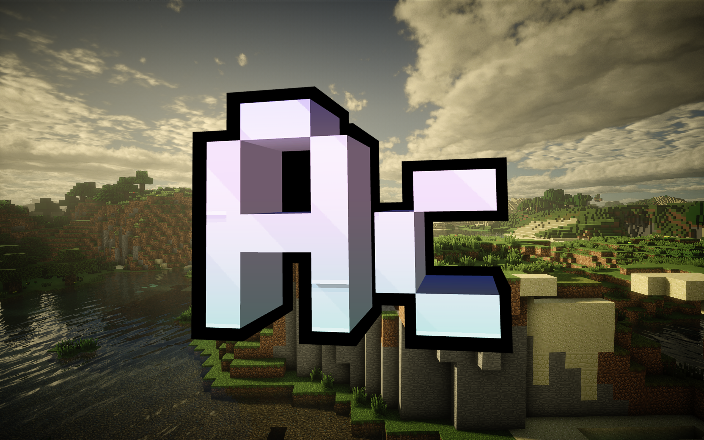

# Actinium
[English](README.en.md)

Actinium 是一个面向 Minecraft 1.12.2 / Cleanroom Loader 的实验性渲染与光影兼容模组。它尝试把更现代的渲染管线带回旧版本客户端，同时兼顾经典模组内容、光影包行为和性能导向的渲染路径。

项目目前围绕 Celeritas、GLSM、GTNHLib 以及类似 Iris 的光影管线展开。重点不是单纯替换某一段渲染代码，而是让地形、实体、阴影、后处理、uniform、framebuffer 归属和 OpenGL 状态切换在旧版客户端中尽量稳定、可控。

## 项目目标

- 重构 Minecraft 1.12.2 客户端的部分渲染路径，使其更接近现代渲染管线。
- 将 Celeritas 的地形渲染思路接入 Cleanroom 环境。
- 接管并稳定 GLSM 相关的 OpenGL 状态管理。
- 实现类似 Iris 的光影阶段模型，包括 `shadow`、`gbuffers`、`prepare`、`deferred`、`composite` 和 `final`。
- 改善依赖现代 framebuffer、uniform 和 program binding 行为的光影包兼容性。
- 保留对旧版模组渲染路径的关注，包括实体、方块实体、粒子、天气、天空、水面反射和实体阴影。

## 当前状态

Actinium 仍处于活跃开发阶段。它还不是一个能覆盖所有 Minecraft 1.12 渲染场景的即插即用替代品；光影包表现也可能受到预设、显卡驱动、模组列表和具体场景影响。

当前开发方向以兼容性为优先：

- 保持原版和模组渲染行为符合预期；
- 让光影包各阶段的输入、输出和时序更可预测；
- 减少旧渲染路径与光影渲染之间隐藏的 OpenGL 状态污染；
- 通过针对性测试和手动光影包验证降低回归风险。

MakeUp、BSL、Complementary 等光影包是开发过程中的重要验证目标，但它们目前更适合作为兼容性测试对象，而不是已经完成承诺的兼容矩阵。

## 运行环境

- Minecraft 1.12.2
- Cleanroom Loader
- Java 25 工具链；构建产物使用 Java 21 字节码
- 能够运行目标光影包的图形环境

## 构建

在项目根目录执行：

```powershell
.\gradlew.bat build --no-daemon
```

如果只需要快速检查 Java 编译：

```powershell
.\gradlew.bat compileJava --no-daemon
```

运行自动化测试与发布前结构校验：

```powershell
.\gradlew.bat check --no-daemon
```

可安装的模组文件是 `build/libs/Actinium-<version>.jar`。`-sources.jar` 仅供开发使用。

jar 版本号由构建时的 git 状态推导：HEAD 上有 tag 时使用 tag；没有 tag 时使用 `gradle.properties` 中的基础版本并追加当前提交的 git sha（如 `2.4.0-dev-2dc019e`）；也可以用 `-Pversion=...` 显式覆盖。

## 模组元数据

Actinium 的 Mod List 元数据统一在 `gradle.properties` 中配置：主模组字段使用 `mod_*` 前缀（`mod_description`、`mod_url`、`mod_authors`、`mod_credits`、`mod_logo_path`）。每次构建也可以通过 `-P` 参数覆盖，例如 `-Pmod_description=...`。

## 仓库结构

- `src/`：Actinium 集成、兼容层、Mixin 和运行时资源。
- `shader/`：集成后的 Iris 风格光影管线。
- `glsm/`：内嵌的 GLSM 侧集成代码。
- `GTNHLib/`：项目使用的 GTNHLib 相关代码。
- `celeritas-common/`：内嵌的 Celeritas 渲染器实现。
- `docs/`：开发记录、兼容性缺口和后续文档。
- `gradle/scripts/`：共享的 Gradle 构建与依赖逻辑。

修改渲染管线前，请先阅读[架构说明](docs/architecture.md)、[当前路线图](docs/roadmap.md)和[兼容性矩阵](docs/compatibility-matrix.md)。第三方源码来源与许可证汇总见 [THIRD_PARTY_NOTICES.md](THIRD_PARTY_NOTICES.md)。

## 参与开发

欢迎任何形式的贡献：报告问题、验证光影包兼容性、提交代码或文档。请先阅读[贡献指南](CONTRIBUTING.md)；报告问题请使用对应的 [issue 模板](.github/ISSUE_TEMPLATE/)。

## AI 生成代码声明

本项目代码几乎全部由 AI 编码代理辅助生成，改动也可能由 AI 审核：
所有改动均经过人工与 AI 的审阅、测试与 dev 回归验证后才合入。若您排斥 AI 生成的代码，
可自行寻找其他替代品；如有疑虑，欢迎通过 issue 联系维护者。

## 相关项目

Actinium 的开发参考、整合并适配了多个项目中的思路、代码和兼容性经验。下面的列表用于说明这些来源；各上游项目仍遵循其原本的许可证和作者归属。

- Celeritas：提供了 Minecraft 1.12 性能优化模组的基础结构和地形渲染方向，Actinium 在此基础上继续适配和扩展。
- GLSM：提供光影包加载、光影状态管理和兼容性行为，Actinium 对其进行集成和稳定化处理。
- GTNHLib：提供旧版渲染栈中使用的工具代码和兼容性基础设施。
- Iris：作为光影管线结构、阶段顺序、framebuffer 行为和光影包预期的重要参考。
- GLSL Transformation Library：用于光影兼容代码中的 GLSL 解析和转换。
- Sodium：为性能导向的现代 Minecraft 渲染器设计提供参考。
- Angelica 与 GTNH 渲染生态：为 Minecraft 1.7/1.12 时代的光影兼容、旧版 OpenGL 行为和模组客户端集成提供参考。
- Cleanroom Loader：提供 Actinium 当前面向的 Minecraft 1.12.2 运行环境。

## 许可证

Actinium 的许可证见 `LICENSE`。

来自其他项目的代码，以及围绕这些代码所做的适配性修改，除非相关源文件中另有明确说明，否则继续遵循各自上游项目原本的许可证。
